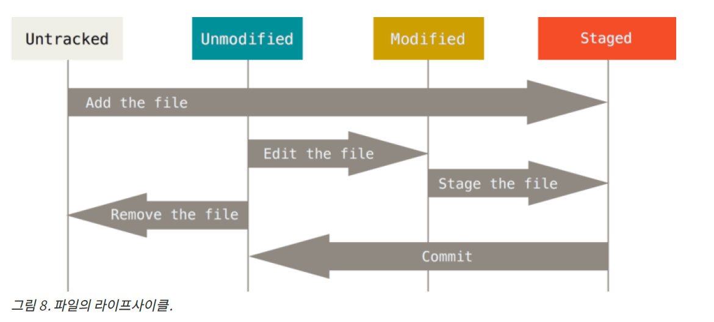

# 개발 스터디 블로그

## 리눅스에 관하여!!
### 리눅스 목차
<ol>
<li>설치방법</li>
<li>리눅스 명령어</li>
<li>설치방법</li>

</ol>

- 깃

    - 깃 상태
    

- hash 대표 알고리즘
    - MD4
    - MD5
    - SHA-1
    - SHA-256
    - SHA-512 
파일 -> HASH FUNCTION() -> 결과값(
    파일이 같은지, 혹은 데이터 위변조체크
)